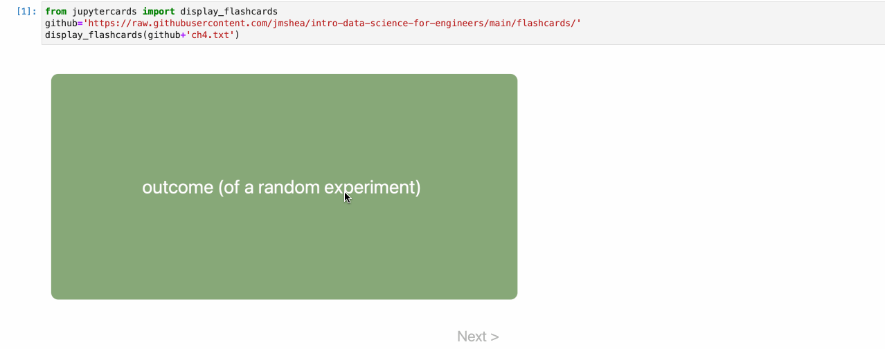

# JupyterCards
*JupyterCards* is a tool for displaying **interactive flash cards in Jupyter notebooks and Jupyter Book**. JupyterCards was created to enable interactive quizzes for readers of my book [*Foundations of Data Science with Python*](https://amzn.to/48cYila)<sup>1</sup>

I have collected all of those flashcards into a single set here: [Data Science Flashcards](https://jmshea.github.io/data-science-flashcards/). Or you can see them in the individual sections on the website for the book at [*Foundations of Data Science with Python* &mdash; Online Resources](https://www.fdsp.net).

The current version of JupyterCards uses a hack to make JupyterCards math work properly on Jupyter Lab/Notebook 4. The issue is that Jupyter 4 installs its own custom MathJax, which does not support all the methods of the full MathJax. I install the regular version of MathJax over Jupyter's custom version. I have tried to work with the Jupyter community to have them expose a method that would allow dynamic updates of displayed math code, but this has not been implemented after almost a year, so I feel I have to release this version. **Please submit an issue if you encounter any problems when using Jupter Cards.**

*JupyterCards* is part of my effort to make **open source tools for developing modern, interactive textbooks**.
* The other part of this effort is my interactive self-assessment quiz tool, 
[JupyterQuiz](https://github.com/jmshea/jupyterquiz).  
* You can see both tools in action in my 
(in-progress) textbook [Foundations of Data Science with Python](https://jmshea.github.io/Foundations-of-Data-Science-with-Python/).

If you would like to see a video that introduces these tools and discusses *why* I made them, check out my [JupyterCon 2023 talk on Tools for Interactive Education Experiences in Jupyter Notebooks and Jupyter Books](https://www.youtube.com/watch?v=MDMUiQ2_ZWE).

Here is an animated GIF showing JupyterCards in action:



Flash card content can be loaded from:
* a Python list of dict,
* a JSON local file,
* via a URL to a JSON file.

As of version 1.7, JupyterCards supports switching cards by swiping left on touch devices. 

**Note:** JupyterCards always requires MathJax to be loaded. If you are using JupyterBook,
it may not always load MathJax if you do not have any LaTeX on your page. To resolve this, 
you can include the invisible math command `$\,\!$` in any Markdown cell. I hope to remove
this requirement in the future.


## Installation 

*JupyterCards* is available via pip:

``` pip install jupytercards```

## Usage in Python

From Python, call the `display_flashcards()` function. Pass it a reference to your card data file or variable (see **Card Data** below). Examples are shown in the provided Jupyter notebook, `example.ipynb'.

## Keyboard Controls

Keyboard controls:
* Space to flip card over
* Enter, right arrow, or j to slide to next card

**Notes:** 
* In Jupyter Book, you may have to click the card to get focus before using the keyboard shortcuts. 
* In Jupyter Lab, hovering your mouse over the body of the card should be sufficient to send key presses to Jupyter Cards.
* In both, you may need to avoid math typeset by MathJax because that can intercept key presses.
* You may disable keyboard control using `keyControl` keyword parameter: `display_flashcards(ref, keyControl = False)`.
* **If you test the keyboard controls, please add your feedback to the related Issue, or email me/tweet at me.**


## Card Data
Jupyter Cards is designed to load card data from a remote or local JSON file; card data may also be loaded directly from a Python variable -- see more further below.

The JSON file should contain a single JSON array of JSON objects. Each JSON object must have the following two keys:
* "front": a string containing the text to be shown on the **front** of the card
* "back": a string containing the text to be shown on the **back** of the card

In addition, each JSON object *may* have the following optional key:
* "topic": a string that identifies a topic that can be used to choose a subset of cards in a file

Although using JSON objects for each flashcard is overkill, this model was chosen to support future extensions to this library.

Cards can also be specified as a Python list of dictionaries with the same keys.

## JupyterLite 

As of version 2.5.0, JupyterCards should work on JupyterLite after loading the modulue via `micropip`:

```python
import micropip
await micropip.install('jupytercards')
                       
from jupytercards import display_flashcards
github='https://raw.githubusercontent.com/jmshea/foundations-of-data-science-with-python/main/04-probability1/flashcards/'
display_flashcards(github+'outcomes-samplespaces-events.json')
```

## Making flashcards in Markdown 

As of version 1.9.0, I have added helper functions to convert flashcards created in Markdown to the
JSON format that JupyterCards expects. In its simplest version, just put the front text in a Markdown
heading (line starting with #) and put the back text below.   See (Markdown-flashcards.ipynb) for
more discussion and examples of how to use this functionality.

## Example of generating flashcard files from JupyterBook notebooks

In my Jupyter notebooks that are used as input to JupyterBook, I use panels with
the heading "DEFINITION" to call out definitions in the text. I have provided a
helper program `extractdefinitions.py` that I use to scan files for the
DEFINITION header and extract the appropriate lines that follow. The resulting
terms and definitions are dumped to corresponding JSON files in a "flashcards"
directory. An additional JSON file is generated for the whole chapter.
`extractdefinitions.py` takes 2 arguments: the directory to parse and the
chapter number to use to label the overall JSON definitions file. **This program
is very specific to my workflow and I am offering it only as reference in case
it can help someone else with a similar situation.**

<sup>1</sup> Affiliate link. As an Amazon Associate I earn from qualifying purchases.
